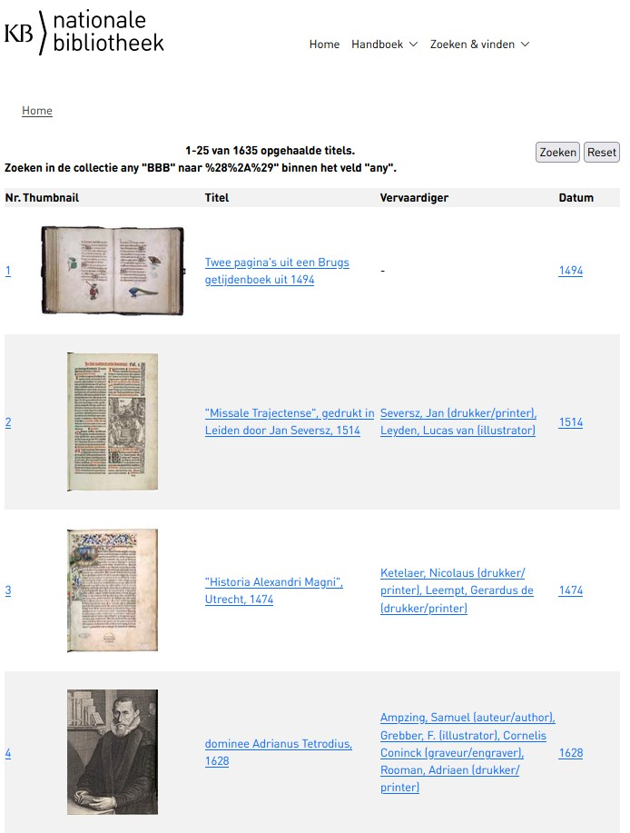

[](https://github.com/KBNLwikimedia/beeldbank-nederlandseboekgeschiedenis-nl)
[](https://www.python.org/)
[](https://creativecommons.org/publicdomain/zero/1.0/)
[](https://commons.wikimedia.org/wiki/Category:Beeldbank_Nederlandse_Boekgeschiedenis)

# Beeldbank Nederlandse Boekgeschiedenis - Extract-Transform-Load Project (for Wikimedia Commons)

ETL pipeline for the **Beeldbank (Image Bank) of Nederlandse Boekgeschiedenis (Dutch Book History)** website, hosted by the KB (Koninklijke Bibliotheek / National Library of the Netherlands).

* Source of images: https://www.nederlandseboekgeschiedenis.nl/nl/beeldbank
* Result: Images uploaded to Wikimedia Commons: [Category:Beeldbank Nederlandse Boekgeschiedenis](https://commons.wikimedia.org/wiki/Category:Beeldbank_Nederlandse_Boekgeschiedenis)

## Table of Contents

### Outcomes
- [Project Status](#project-status-complete)
- [Examples of Uploaded Images](#examples-of-uploaded-images)
- [Excel Data File](#excel-data-file)
- [Quality Control: SPARQL Queries](#quality-control-sparql-queries)

### Project Context
- [Project Scope](#project-scope)
- [Completed Goals](#completed-goals)
- [Copyright Status](#copyright-status)
- [Relevant Websites](#relevant-websites)

### Approach
- [Technical Approach](#technical-approach)
- [Structured Data Statements](#structured-data-statements)
- [Artwork Template Mapping](#artwork-template-mapping)
- [Classification to Commons Categories Mapping](#classification-to-commons-categories-mapping)

### Technical Reference
- [Scripts](#scripts)
- [Preview and Review Pages](#preview-and-review-pages)
- [Installation](#installation)
- [Configuration](#configuration)
- [Requirements](#requirements)
- [License](#license)

---

# Outcomes

## Project Status: Complete

| Metric | Count |
|--------|-------|
| Total items in collection | 1,632 |
| Public domain items | 803 |
| **Uploaded to Commons** | **803 (100%)** |
| **With structured data** | **803 (100%)** |

All 803 public domain files have been successfully uploaded to Wikimedia Commons with complete metadata (using the `{{Artwork}}` template) and structured data (Wikibase statements). The uploads were completed on **29 January 2026**.

## Examples of Uploaded Images

Three example files uploaded to [Wikimedia Commons](https://commons.wikimedia.org/wiki/Category:Beeldbank_Nederlandse_Boekgeschiedenis):

| Thumbnail | ID | Title | Commons Link |
|:---------:|-------|-------|--------------|
| [](https://commons.wikimedia.org/wiki/File:De_wolf_en_de_ezel_uit_de_Dyalogus_creaturarum_gedrukt_door_Gheraert_Leeu_Gouda,_1481_-_BBB-1.jpg) | BBB-1 | De wolf en de ezel uit de "Dyalogus creaturarum" gedrukt door Gheraert Leeu, Gouda, 1481 | [View on Commons](https://commons.wikimedia.org/wiki/File:De_wolf_en_de_ezel_uit_de_Dyalogus_creaturarum_gedrukt_door_Gheraert_Leeu_Gouda,_1481_-_BBB-1.jpg) |
| [](https://commons.wikimedia.org/wiki/File:De_verdrijving_uit_het_paradijs_uit_Passio_Domini_nostri_Iesu_Christi_Amsterdam,_1523_-_BBB-2.jpg) | BBB-2 | "De verdrijving uit het paradijs" uit "Passio Domini nostri Iesu Christi", Amsterdam, 1523 | [View on Commons](https://commons.wikimedia.org/wiki/File:De_verdrijving_uit_het_paradijs_uit_Passio_Domini_nostri_Iesu_Christi_Amsterdam,_1523_-_BBB-2.jpg) |
| [](https://commons.wikimedia.org/wiki/File:Vita_splendida_uit_Recht_ghebruyck_ende_misbruck_van_tydlycke_have_Leiden,_1585_-_BBB-3.jpg) | BBB-3 | 'Vita splendida' uit "Recht ghebruyck ende misbruck van tydlycke have", Leiden, 1585 | [View on Commons](https://commons.wikimedia.org/wiki/File:Vita_splendida_uit_Recht_ghebruyck_ende_misbruck_van_tydlycke_have_Leiden,_1585_-_BBB-3.jpg) |

## Excel Data File

The main data file (`nbg-beeldbank_all_24012026.xlsx`) contains all scraped metadata and upload tracking information.

**Sheets:**
- **all**: All 1,632 records with tracking columns
- **public-domain-files**: 803 records filtered for public domain (pre-1886)

**Columns:**

| Column | Description | Used in Template |
|--------|-------------|------------------|
| `unique_id` | Record identifier (e.g., BBB-1) | Source field |
| `titel` | Title of the item | `title`, P1476 |
| `WikiCommonsFilename` | Target filename on Commons | Upload filename |
| `datum` | Date/year | `date` |
| `vervaardiger` | Creator/maker | `artist` |
| `periode` | Century/period | Not used |
| `type` | Type (Dutch, English) | `object type` (bilingual) |
| `afmetingen` | Dimensions | `dimensions` |
| `inhoud` | Description | `description` (wrapped in `{{nl|...}}`) |
| `classificatie` | Classification codes | Mapped to Commons categories |
| `gerelateerde_term` | Related terms | Not used |
| `origineel` | Original source | `notes` (prefixed) |
| `aanwezig_in` | Location/Institution | `accession number` |
| `image_url` | Full resolution image URL | Source field, P953 |
| `detail_url` | Link to detail page | Source field, P973 |
| `local_image_path` | Path to downloaded image | Upload source |
| `commons_categories` | Mapped Commons categories | Categories |
| `in_public_domain_files` | Whether file is in public domain | Filter for upload |
| `CommonsURL` | Wikimedia Commons file URL | After upload |
| `CommonsMidURL` | Commons M-id entity URL | After upload |
| `structured_data_added` | Whether structured data was added | Tracking |

## Quality Control: SPARQL Queries

The `commons-sparql-queries/` folder contains SPARQL queries for quality checking the uploaded files and their structured data via the [Wikimedia Commons Query Service](https://commons.wikimedia.org/wiki/Special:SPARQL).

| Query File | Description |
|------------|-------------|
| [`all-files-and-their-structured-data.rq`](commons-sparql-queries/all-files-and-their-structured-data.rq) | Retrieves all structured data fields for each file: Dutch caption, title (P1476), collection (P195), copyright status (P6216), instance of (P31), MIME type (P1163), and source URLs. Use this to verify completeness of structured data. |
| [`all-files-and-their-KB-source-URLs.rq`](commons-sparql-queries/all-files-and-their-KB-source-URLs.rq) | Retrieves the KB source URLs from the P7482 (source of file) statement: P973 (described at URL) and P953 (full work available at URL). Use this to verify all files have proper source attribution. |
| [`all-files-and-their-Commons-URLs.rq`](commons-sparql-queries/all-files-and-their-Commons-URLs.rq) | Generates various Commons URLs for each file: full image URL, file page URL, and short URL. Useful for creating link lists or verifying file accessibility. |

### Running the Queries

1. Go to [Wikimedia Commons Query Service](https://commons.wikimedia.org/wiki/Special:SPARQL) (login required)
2. Copy the content of a `.rq` file and paste it into the query editor
3. Click "Run" to execute the query
4. Results can be downloaded as CSV, JSON, or other formats

These queries retrieve all files from [Category:Beeldbank Nederlandse Boekgeschiedenis](https://commons.wikimedia.org/wiki/Category:Beeldbank_Nederlandse_Boekgeschiedenis) and display their metadata, making it easy to identify files with missing or incorrect structured data.

---

# Project Context

## Project Scope

This project:
* **Extracted** metadata and images from the **1,632 digitized historical book-related items** in the [Beeldbank Nederlandse Boekgeschiedenis](https://www.nederlandseboekgeschiedenis.nl/nl/beeldbank),
* **Transformed** them into Wikimedia Commons suitable data, and
* **Loaded** all 803 public domain files to Wikimedia Commons with proper metadata, structured data, and categorization.

## Completed Goals

- Scraped all metadata and image URLs from the Beeldbank (1,632 items)
- Downloaded high-resolution images locally
- Uploaded 803 public domain images to Wikimedia Commons using the `{{Artwork}}` template
- Added structured data (Wikibase statements) to all 803 files
- Properly categorized files based on classification

## Copyright Status

This project targets only images that are **in the public domain** - works that are out of copyright both in the Netherlands/EU and in the USA. The collection primarily contains historical book-related materials (manuscripts, prints, illustrations) from before the 20th century, ensuring they are no longer protected by copyright in any major jurisdiction.

## Relevant Websites

- **Beeldbank search interface**: https://www.nederlandseboekgeschiedenis.nl/nl/beeldbank
- **Image resolver**: `http://resolver.kb.nl/resolve?urn=urn:BBB:{urn}`
- **Commons category**: [Category:Beeldbank Nederlandse Boekgeschiedenis](https://commons.wikimedia.org/wiki/Category:Beeldbank_Nederlandse_Boekgeschiedenis)
- **KB (Koninklijke Bibliotheek)**: https://www.kb.nl/

<br>
<em>Homepage with search results of https://www.nederlandseboekgeschiedenis.nl/nl/beeldbank, dd 28-01-2026</em>

---

# Approach

## Technical Approach

### Pipeline Overview

```
┌─────────────┐    ┌──────────────────┐    ┌─────────────┐    ┌─────────────────┐
│  scraper.py │ -> │ download_images.py│ -> │ uploader.py │ -> │structured_data.py│
│  (metadata) │    │    (images)       │    │  (upload)   │    │  (statements)   │
└─────────────┘    └──────────────────┘    └─────────────┘    └─────────────────┘
       ↓                   ↓                      ↓                    ↓
   Excel file         images/folder         Commons files      Structured data
```

### Step-by-Step Process

1. **Scrape metadata** (`scraper.py`) - Extract metadata from Beeldbank search results
2. **Download images** (`download_images.py`) - Download full-resolution images from KB resolver
3. **Prepare filenames** - Clean and standardize filenames for Commons (manual step in Excel)
4. **Map categories** - Map Dutch classifications to Commons categories
5. **Upload to Commons** (`uploader.py`) - Upload images with `{{Artwork}}` template
6. **Add structured data** (`structured_data.py`) - Add Wikibase statements to each file

## Structured Data Statements

Each uploaded file receives the following Wikibase statements:

| Property | Name | Value |
|----------|------|-------|
| P31 | Instance of | Q1250322 (digital image) |
| P195 | Collection | Q1526131 (Koninklijke Bibliotheek) |
| P6216 | Copyright status | Q19652 (public domain) |
| P1163 | MIME type | image/jpeg |
| P1476 | Title | (from `titel` column, Dutch) |
| P7482 | Source of file | Q74228490 (file available on the internet) |
| ↳ P137 | Operator | Q1526131 (Koninklijke Bibliotheek) |
| ↳ P953 | Full work available at URL | (from `image_url`) |
| ↳ P973 | Described at URL | (from `detail_url`) |

Additionally, a Dutch label (caption) is added from the `titel` column.

## Artwork Template Mapping

The `{{Artwork}}` template is populated as follows:

| Template Field | Source / Excel column | Required |
|----------------|----------------------|----------|
| `title` | `titel` | Optional |
| `artist` | `vervaardiger` | Recommended |
| `description` | `inhoud` (wrapped in `{{nl\|1=...}}`) | Optional |
| `date` | `datum` | Optional |
| `dimensions` | `afmetingen` | Optional |
| `object type` | `type` (formatted as `{{nl\|...}} {{en\|...}}`) | Optional |
| `institution` | Static: `{{Institution:Koninklijke Bibliotheek}}` | Optional |
| `source` | Composite from `image_url`, `detail_url`, `unique_id` | **Required** |
| `accession number` | `aanwezig_in` | Optional |
| `notes` | `origineel` (prefixed with "Orgineel:") | Optional |

**License**: `{{PD-US-expired|PD-old-70}}`

## Classification to Commons Categories Mapping

Only specific Dutch classifications are mapped to Commons categories (to avoid overly broad categorization):

| Code | Dutch Classification | Commons Category |
|------|---------------------|------------------|
| C | Paleografie, letterontwerp, lettertypen, lettergieten, schrift | [Dutch typography](https://commons.wikimedia.org/wiki/Category:Dutch_typography) |
| D | Geschiedenis van de boekdrukkunst | [Printing in the Netherlands](https://commons.wikimedia.org/wiki/Category:Printing_in_the_Netherlands) |
| F | Bindkunst | [Bookbinding in the Netherlands](https://commons.wikimedia.org/wiki/Category:Bookbinding_in_the_Netherlands) |
| J | Bibliotheken en instellingen | [Libraries in the Netherlands](https://commons.wikimedia.org/wiki/Category:Libraries_in_the_Netherlands) |

**Excluded classifications** (too broad):
- B, E, G, H, K, L (book-specific but no Dutch variant)
- M0-M9 (general subject classifications)

All files are automatically added to `[[Category:Beeldbank Nederlandse Boekgeschiedenis]]`.

---

# Technical Reference

## Scripts

### scraper.py
Scrapes metadata from the Beeldbank search interface using Playwright (browser automation required due to JavaScript/AJAX content).

```bash
python scraper.py
```

### download_images.py
Downloads high-resolution images from the KB resolver service.

```bash
python download_images.py
```

### commons_template.py
Defines the mapping between Excel columns and the `{{Artwork}}` template fields. Generates wikitext for file description pages.

**Key functions:**
- `generate_wikitext(row)` - Generate complete wikitext for a record
- `get_upload_filename(row)` - Get the Commons filename
- `format_bilingual_type(type_str)` - Format type as `{{nl|...}} {{en|...}}`

### uploader.py
Uploads images to Wikimedia Commons with proper metadata. Includes throttling and exponential backoff to avoid overwhelming the server.

```bash
# Preview upload
python uploader.py --preview BBB-1

# Upload single file
python uploader.py BBB-1

# Batch upload (rows 0-10)
python uploader.py --batch 0 10

# Batch upload with custom delay (10 seconds between uploads)
python uploader.py --batch 0 10 --delay 10
```

**Throttling defaults:**
- Delay between uploads: 5 seconds
- Max retries on failure: 3 (with exponential backoff)
- Backoff factor: 2x per retry (5s → 10s → 20s)

### structured_data.py
Adds structured data (Wikibase statements) to Commons files.

```bash
# Add Dutch description only
python structured_data.py BBB-1

# Add statements only
python structured_data.py --statements BBB-1

# Add both description and statements
python structured_data.py --all BBB-1

# Batch mode
python structured_data.py --batch 0 10 --all
```

## Preview and Review Pages

The `previews/` folder contains HTML pages for reviewing images before upload. These require a local web server:

```bash
python -m http.server 8000  # Start server in project root
```

Then open pages at `http://localhost:8000/previews/...`

### Public Domain Review

Review all 803 public domain images to verify copyright status:

- **[Public Domain Review](previews/pd_review_all.html)** - All images with pagination (100 per page)

Features: view images with ID/title/date, flag images as NOT public domain, search/filter, export flagged IDs.

### Category Selection

Select which images should receive specific Commons categories:

- **[All categories (combined)](previews/pd_preview_all.html)** - Tabbed interface with all 4 categories
- [Dutch typography](previews/pd_preview_dutch_typography.html) (44 images)
- [Printing in the Netherlands](previews/pd_preview_printing_netherlands.html) (300 images)
- [Bookbinding in the Netherlands](previews/pd_preview_bookbinding_netherlands.html) (98 images)
- [Libraries in the Netherlands](previews/pd_preview_libraries_netherlands.html) (50 images)

Exclusions are saved to `category_exclusions.json` which is read by `uploader.py`.

**Note:** Use Chrome or Edge (Firefox doesn't support the File System Access API for saving).

Generate all preview pages:
```bash
python create_preview.py
```

## Installation

```bash
# Install dependencies
pip install -r requirements.txt

# Install Playwright browser
python -m playwright install chromium
```

## Configuration

Create a `.env` file with your Wikimedia Commons credentials:

```env
COMMONS_USERNAME=YourUsername@YourBotName
COMMONS_PASSWORD=your_bot_password_here
COMMONS_USER_AGENT=Your tool description (contact@email.com)
```

Bot passwords can be created at: https://commons.wikimedia.org/wiki/Special:BotPasswords

## Requirements

See `requirements.txt`:
- playwright (browser automation for scraping)
- pandas (data handling)
- openpyxl (Excel files)
- mwclient (Wikimedia API)
- python-dotenv (environment variables)
- requests (HTTP requests)

## License

This project uploads **public domain content** from the KB collection to Wikimedia Commons. All images in this collection are out of copyright in both the Netherlands/EU (life of author + 70 years) and the USA, making them free to use worldwide. Files are tagged with `{{PD-US-expired|PD-old-70}}` on Commons.
