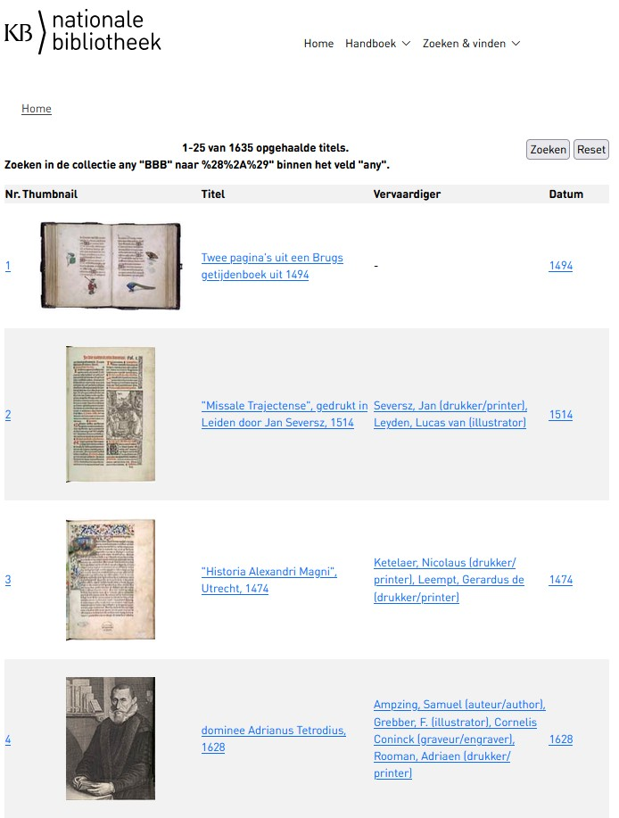

# Beeldbank Nederlandse Boekgeschiedenis - Extract-Transform-Load Project (for Wikimedia Commons)

ETL pipeline for the **Beeldbank (Image Bank) of Nederlandse Boekgeschiedenis (Dutch Book History)** website, hosted by the KB (Koninklijke Bibliotheek / National Library of the Netherlands).

TL;DR:
* Source of images: 1.632 images from https://www.nederlandseboekgeschiedenis.nl/nl/beeldbank, a collection of digitized images about the history of printed books in the Netherlands, largely from the collections of the KB, National Library of the Netherlands.
* Result: 999 public domain images uploaded to Wikimedia Commons: [Category:Beeldbank Nederlandse Boekgeschiedenis](https://commons.wikimedia.org/wiki/Category:Beeldbank_Nederlandse_Boekgeschiedenis), including 
  * [structured data statements](#structured-data-statements) and associated [SPARQL queries](#quality-control-sparql-queries), 
  * (partial) categorisation into [topical Wikimedia Commons categories](#classification-to-commons-categories-mapping), and a  
  * [dataset as Excel](#excel-data-file). 

## Table of contents

### Outcomes
- [Project Status](#project-status-complete)
- [Examples of Uploaded Images](#examples-of-uploaded-images)
- [Excel Data File](#excel-data-file)
- [Quality Control: SPARQL Queries](#quality-control-sparql-queries)

### Project context
- [Project Scope and Completed Goals](#project-scope-and-completed-goals)
- [Copyright Status](#copyright-status)
- [Relevant Websites](#relevant-websites)

### Approach
- [Technical Approach](#technical-approach)
- [Structured Data Statements](#structured-data-statements)
- [Artwork Template Mapping](#artwork-template-mapping)
- [Classification to Commons Categories Mapping](#classification-to-commons-categories-mapping)

### Technical Reference
- [Scripts](#scripts)
- [Preview and Review Pages](#preview-and-review-pages)
- [Installation](#installation)
- [Configuration](#configuration)
- [Requirements](#requirements)
- [License](#license)

---

# Outcomes

## Project status: Complete

| Metric                         | Count |
|--------------------------------|-------|
| Total items in collection      | 1,632 |
| Public domain items            | 999 |
| Images uploaded to Commons | 999 (100%) |
| Structured data added      | 999 (100%) |

All 999 public domain files from this image bank have been successfully uploaded to Wikimedia Commons with complete Wikitext metadata, using the `{{Artwork}}` template and structured data (Wikibase statements). The uploads were completed on **3 February 2026**.

## Examples of source images and their metadata

The source of the images and their metadata is https://www.nederlandseboekgeschiedenis.nl/nl/beeldbank. You can query for '*' to see all results.

 
<em>Homepage with search results of https://www.nederlandseboekgeschiedenis.nl/nl/beeldbank, dd 28-01-2026</em>

## Examples of uploaded images

Three example files uploaded to [Wikimedia Commons](https://commons.wikimedia.org/wiki/Category:Beeldbank_Nederlandse_Boekgeschiedenis):

| Thumbnail | ID | Title |
|:---------:|-------|-------|
|  | BBB-1 | [De wolf en de ezel uit de "Dyalogus creaturarum" gedrukt door Gheraert Leeu, Gouda, 1481](https://commons.wikimedia.org/wiki/File:De_wolf_en_de_ezel_uit_de_Dyalogus_creaturarum_gedrukt_door_Gheraert_Leeu_Gouda,_1481_-_BBB-1.jpg) |
|  | BBB-2 | ["De verdrijving uit het paradijs" uit "Passio Domini nostri Iesu Christi", Amsterdam, 1523](https://commons.wikimedia.org/wiki/File:De_verdrijving_uit_het_paradijs_uit_Passio_Domini_nostri_Iesu_Christi_Amsterdam,_1523_-_BBB-2.jpg) |
|  | BBB-3 | ['Vita splendida' uit "Recht ghebruyck ende misbruck van tydlycke have", Leiden, 1585](https://commons.wikimedia.org/wiki/File:Vita_splendida_uit_Recht_ghebruyck_ende_misbruck_van_tydlycke_have_Leiden,_1585_-_BBB-3.jpg) |

## Excel data File

The main data file (`nbg-beeldbank_all_24012026.xlsx`) contains all metadata and upload tracking information.

**Excel sheets:**
- **all**: All 1,632 records with tracking columns
- **public-domain-files**: 999 records filtered for public domain that have been uploaded to Commons

**Columns:**

| Column | Description | Used for                       |
|--------|-------------|---------------------------------|
| `unique_id` | Record identifier (e.g., BBB-1) | Source field                    |
| `titel` | Title of the item | `title`, P1476                  |
| `WikiCommonsFilename` | Target filename on Commons | Upload filename                 |
| `datum` | Date/year | `date`                          |
| `vervaardiger` | Creator/maker | `artist`                        |
| `periode` | Century/period | Not used                        |
| `type` | Type (Dutch, English) | `object type` (bilingual)       |
| `afmetingen` | Dimensions | `dimensions`                    |
| `inhoud` | Description | `description` (wrapped in `{{nl |...}}`) |
| `classificatie` | Classification codes | Mapped to Commons categories    |
| `gerelateerde_term` | Related terms | Not used                        |
| `origineel` | Original source | `notes` (prefixed)              |
| `aanwezig_in` | Location/Institution | `accession number`              |
| `image_url` | Full resolution image URL | Source field, P953              |
| `detail_url` | Link to detail page | Source field, P973              |
| `local_image_path` | Path to downloaded image | Upload source                   |
| `commons_categories` | Mapped Commons categories | Categories                      |
| `in_public_domain_files` | Whether file is in public domain | Filter for upload               |
| `CommonsURL` | Wikimedia Commons file URL | After upload                    |
| `CommonsMidURL` | Commons M-id entity URL | After upload                    |
| `structured_data_added` | Whether structured data was added | Tracking                        |

## Artwork Wikitext template mapping

The [`{{Artwork}}` Wikitext template](https://commons.wikimedia.org/w/index.php?title=File:19e_eeuwse_boekbinderij,_1861_-_BBB-478.jpg&action=edit) is populated as follows:

| Template Field | Source / Excel column               | Required |
|----------------|------------------------------------------------------|----------|
| `title` | `titel`                                              | Optional |
| `artist` | `vervaardiger`                                       | Recommended |
| `description` | `inhoud` (wrapped in `{{nl\|1=...}}`)                | Optional |
| `date` | `datum`                                              | Optional |
| `dimensions` | `afmetingen`                                         | Optional |
| `object type` | `type` (formatted as `{{nl\|...}} {{en\|...}}`)      | Optional |
| `institution` | Static: `{{Institution:Koninklijke Bibliotheek}}`    | Optional |
| `source` | Composite from `image_url`, `detail_url`, `unique_id` | **Required** |
| `accession number` | `aanwezig_in`                                        | Optional |
| `notes` | `origineel` (prefixed with "Orgineel:")              | Optional |

**Available license templates:**

| Template                                                                                 | Use for |
|------------------------------------------------------------------------------------------|---------|
| [`{{PD-old-70-expired}}`](https://commons.wikimedia.org/wiki/Template:PD-old-70-expired) | Known authors who died 70+ years ago |
| [`{{PD-anon-70-EU}}`](https://commons.wikimedia.org/wiki/Template:PD-anon-70-EU)         | Anonymous EU works 70+ years old |
| [`{{PD-anon-expired}}`](https://commons.wikimedia.org/wiki/Template:PD-anon-expired)     | Anonymous works, expired copyright |
| [`{{PD-Art\|PD-old-70-expired}}`](https://commons.wikimedia.org/wiki/Template:PD-Art)    | Faithful reproduction of 2D PD artwork |

## Structured data statements

Each uploaded file has received the following Wikibase statements:

| Property | Name | Value |
|----------|------|-------|
| P31 | Instance of | Q1250322 (digital image) |
| P195 | Collection | Q1526131 (Koninklijke Bibliotheek) |
| P6216 | Copyright status | Q19652 (public domain) |
| P1163 | MIME type | image/jpeg |
| P1476 | Title | (from `titel` column, Dutch) |
| P7482 | Source of file | Q74228490 (file available on the internet) |
| ↳ P137 | Operator | Q1526131 (Koninklijke Bibliotheek) |
| ↳ P953 | Full work available at URL | (from `image_url`) |
| ↳ P973 | Described at URL | (from `detail_url`) |

Additionally, a Dutch label (caption) for each file has been added from the Excel `titel` column.

## Quality control: SPARQL queries

The `commons-sparql-queries/` folder contains SPARQL queries for quality checking the uploaded files and their structured data statements via the [Wikimedia Commons Query Service](https://commons.wikimedia.org/wiki/Special:SPARQL).

| Query File | Description |
|------------|-------------|
| [`all-files-and-their-structured-data.rq`](commons-sparql-queries/all-files-and-their-structured-data.rq) | Retrieves all structured data fields for each file: Dutch caption, title (P1476), collection (P195), copyright status (P6216), instance of (P31), MIME type (P1163), and source URLs. Use this to verify completeness of structured data. |
| [`all-files-and-their-KB-source-URLs.rq`](commons-sparql-queries/all-files-and-their-KB-source-URLs.rq) | Retrieves the KB source URLs from the P7482 (source of file) statement: P973 (described at URL) and P953 (full work available at URL). Use this to verify all files have proper source attribution. |
| [`all-files-and-their-Commons-URLs.rq`](commons-sparql-queries/all-files-and-their-Commons-URLs.rq) | Generates various Commons URLs for each file: full image URL, file page URL, and short URL. Useful for creating link lists or verifying file accessibility. |

### Running the queries

1. Go to [Wikimedia Commons Query Service](https://commons.wikimedia.org/wiki/Special:SPARQL) (login required)
2. Copy the content of a `.rq` file and paste it into the query editor
3. Click "Run" to execute the query
4. Results can be downloaded as CSV, JSON, or other formats

These queries retrieve all files from [Category:Beeldbank Nederlandse Boekgeschiedenis](https://commons.wikimedia.org/wiki/Category:Beeldbank_Nederlandse_Boekgeschiedenis) and display their structured metadata, making it easy to identify files with missing or incorrect data fields.

---

# Project background

## Project scope and completed goals

This ETL project 
* **Extracted** metadata and images from the **1,632 digitized historical book-related items** in the [Beeldbank Nederlandse Boekgeschiedenis](https://www.nederlandseboekgeschiedenis.nl/nl/beeldbank), 
* **Transformed** them into Wikimedia Commons-suitable data, and
* **upLoaded** all 999 public domain files to Wikimedia Commons.

**Completed:**
- Scraped all metadata and image URLs from the Beeldbank (1,632 items)
- Downloaded high-resolution images locally
- Uploaded 999 public domain images to Wikimedia Commons using the `{{Artwork}}` template
- Added structured data (Wikibase statements) to all 999 files
- Categorized files based on classification mapping

## Copyright status

This project targets only images that are **in the public domain** - works that are out of copyright both in the Netherlands/EU and in the USA. The collection primarily contains historical book-related materials (manuscripts, prints, illustrations) from before the 20th century, ensuring they are no longer protected by copyright in any major jurisdiction.

**Used public domain license templates**: [`{{PD-old-70-expired}}`](https://commons.wikimedia.org/wiki/Template:PD-old-70-expired) or [`{{PD-Art|PD-old-70-expired}}`](https://commons.wikimedia.org/wiki/Template:PD-Art) or in case of unkown/anonymous creators [`{{PD-anon-70-EU}}`](https://commons.wikimedia.org/wiki/Template:PD-anon-70-EU) or  [`{{PD-anon-expired}}`](https://commons.wikimedia.org/wiki/Template:PD-anon-expired). 

---

# Technical Approach

## Step-by-Step Process

1. **Scrape metadata** (`scraper.py`) - Extract metadata from Beeldbank search results using Playwright (browser automation required due to JavaScript/AJAX content)
2. **Download images** (`download_images.py`) - Download full-resolution images from KB resolver service
3. **Prepare filenames** - Clean and standardize filenames for Commons (manual step in Excel)                                               
4. **Upload to Commons** (`uploader.py`) - Upload images with `{{Artwork}}` template wikitext generated by `commons_template.py`. Includes throttling and exponential backoff.
5. **Add structured data** (`structured_data.py`) - Add Wikibase structured data statements to each file
6. **Map categories** - Map Dutch classifications to topical Commons categories (see below)   

## Classification to Commons categories mapping

Only specific Dutch classifications are mapped to Commons categories (to avoid overly broad categorization):

| Code | Dutch Classification | Commons Category | Images |
|------|----------------------|------------------|--------|
| C | Paleografie, letterontwerp, lettertypen, lettergieten, schrift | [Dutch typography](https://commons.wikimedia.org/wiki/Category:Dutch_typography) | 44 |
| D | Geschiedenis van de boekdrukkunst | [Printing in the Netherlands](https://commons.wikimedia.org/wiki/Category:Printing_in_the_Netherlands) | 300 |
| F | Bindkunst | [Bookbinding in the Netherlands](https://commons.wikimedia.org/wiki/Category:Bookbinding_in_the_Netherlands) | 98 |
| J | Bibliotheken en instellingen | [Libraries in the Netherlands](https://commons.wikimedia.org/wiki/Category:Libraries_in_the_Netherlands) | 50 |

**Excluded classifications** (too broad): B, E, G, H, K, L (book-specific but no Dutch variant), M0-M9 (general subject classifications).

All files are automatically added to [`Category:Beeldbank Nederlandse Boekgeschiedenis`](https://commons.wikimedia.org/wiki/Category:Beeldbank_Nederlandse_Boekgeschiedenis).

## License

This project uploads **public domain content** from the KB collection to Wikimedia Commons. 

## Licensing

All historical collection images in this collection are out of copyright in both the Netherlands/EU (life of author + 70 years) and the USA, making them free to use worldwide.

The Python scripts and Excel file in this repo are released into the public domain under [CC0 1.0 public domain dedication](LICENSE). Feel free to reuse and adapt. Attribution *(KB, National Library of the Netherlands)* is appreciated but not required.

## Contact & Credits

* Author: Olaf Janssen, Wikimedia coordinator [@ KB, National Library of the Netherlands](https://www.kb.nl)
* Contact via [KB expert page](https://www.kb.nl/over-ons/experts/olaf-janssen) or [Wikimedia user page](https://commons.wikimedia.org/wiki/User:OlafJanssen).